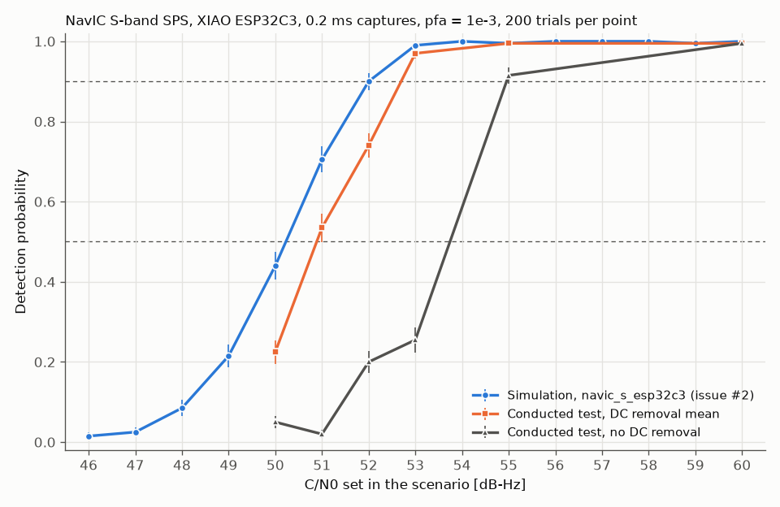

# Conducted test of NavIC S-band SPS on the XIAO ESP32C3

This page records the conducted test of milestone M3 (GitHub issue #11). A B210-class
generator played a NavIC S-band SPS signal with noise added in software, through cables and
attenuators only, into a Seeed XIAO ESP32C3 running the ESP-SDR firmware. The XIAO's captures
were acquired and the probability of detection was compared with the simulated curve of
[Detection probability versus C/N0](pd-curves.md). Nothing was radiated.

Terms used on this page:

- *C/N0:* carrier-to-noise density ratio in dB-Hz. Here it is the value set in the scenario
  that wrote the playback file, unless the text says otherwise.
- *Capture:* one `CAP20` request of the ESP-SDR firmware, 16 380 complex samples at 80 MSa/s
  (204.75 µs), 10 bits per component.
- *Run:* 200 captures (20 for a bracket) taken while one playback file was transmitted.
- *Bracket:* 20 captures at 60 dB-Hz taken just before and just after a run, to measure the
  carrier frequency seen by the XIAO at that time.
- *Bin:* the frequency step of the acquisition search, 1/(2T) for a capture of length T, here
  2442.0 Hz.
- *Detection metric:* the largest correlation power of the search grid divided by the mean
  power of the other cells (`snappnt.rx.acquire`). A capture is *above threshold* when the
  metric exceeds the threshold for a false-alarm probability `pfa` = 1e-3 over the grid.
- *In-band rise:* the ratio, in dB, of the mean power spectral density (PSD) with the
  generator on to the PSD with the generator off, over the generator's band, without the
  generator's LO leakage line and without the bins near 0 Hz.

## Bench

```
B210 clone, TRX1 port ─ 30 dB ─ 20 dB ─ 10 dB ─ DC block ─ SMA to U.FL cable ─ XIAO ESP32C3
TRX2, RX1, RX2 of the B210 clone: 50 Ω loads (as stated by the maintainer for the runs)
```

| Item | Value |
|---|---|
| Generator | B210 clone (AD9361) in its case, port TRX1 (UHD TX channel 0, `FE-TX2`), UHD 4.10, `tx_samples_from_file` with `--args "num_send_frames=512"` |
| Generator settings | Centre 2490.528 MHz, 8 MSa/s, transmit gain 60 dB, playback repeated (`--repeat`) |
| Attenuators | 30 + 20 + 10 dB, three sections of one unshielded four-section board (the fourth section unused, its connectors open) |
| Receiver | Seeed XIAO ESP32C3, ESP-SDR firmware (`INFO` reply `C3SDR 6 burst 16380`), native USB |
| Receiver settings | 2492 MHz, 80 MSa/s, gain index 60 fixed (`GAIN MANUAL 60 0 79 1`), analog bandwidth 14 MHz (`LPF 63 34 34`), 10-bit transfer |
| Splitter | None: no divider was available. There was no simultaneous reference receiver. |
| Sequential reference | HackRF One (compatible board, not made by Great Scott Gadgets), receive only, in place of the XIAO; see the section "Reference recording with a HackRF One" |

The XIAO is tuned in whole MHz only, so the signal at 2492.028 MHz appears at a nominal +28 kHz
in the XIAO's baseband, plus the difference of the crystal errors of the two devices. The
B210 clone's LO leakage at 2490.528 MHz appears at −1.472 MHz in the XIAO's baseband, and the
8 MSa/s playback covers −5.472 to +2.528 MHz.

The generator power at its output was not measured (no power meter). The level was set with
the in-band rise seen by the XIAO instead (next sections).

## Playback files

| Scenario | C/N0 [dB-Hz] |
|---|---|
| `navic_s_conducted_gen.yaml` | 60 |
| `navic_s_conducted_gen_cn0_55.yaml` | 55 |
| `navic_s_conducted_gen_cn0_53.yaml` | 53 |
| `navic_s_conducted_gen_cn0_52.yaml` | 52 |
| `navic_s_conducted_gen_cn0_51.yaml` | 51 |
| `navic_s_conducted_gen_cn0_50.yaml` | 50 |
| `navic_s_conducted_gen_noise.yaml` | no satellite (`satellites: []`) |

All seven are the same apart from the satellite: PRN 10, Doppler 0 Hz, code phase 0 chips,
8 MSa/s, 8 000 000 samples (one second, 50 data symbols, so the loop point does not cut a
symbol), carrier 1.5 MHz above the generator's centre, seed 4. Each was written with
`snappnt sim <scenario> --uhd`. The sc16 writer scales each file to its own peak (0.7 of full
scale); the root-mean-square level of all seven files is −17.6 to −17.7 dBFS, so the
generator's output power is the same for all runs to within 0.1 dB.

The C/N0 values 51 and 53 dB-Hz were added after the first runs, beyond the grid of the
approved plan (60, 55, 52, 50 dB-Hz), to see whether the measured curve has the slope of the
simulated one.

## Setting the level

The XIAO took 20 captures with the generator off, then 20 captures while the 60 dB-Hz file was
played, at increasing transmit gain. `tools/conducted_pd.py rise` compared the two sets over
the generator's band (89 PSD bins of 78.1 kHz).

| Transmit gain [dB] | In-band rise [dB] | Above threshold |
|---|---|---|
| 0 | 0.16 | — |
| 20 | 0.36 | 0 of 20 |
| 60 | 18.09 | 20 of 20 |

- Two halves of the generator-off set differ by 0.09 dB in the band and 0.29 dB in the
  LO-leakage bins, so the rises at gain 0 and 20 are at the level of this spread. The playback
  noise was then far below the receiver's own noise.
- At gain 60 the rise is 18.1 dB: the noise of the playback is about 18 dB above the
  receiver's own noise, which changes C/N0 by about 0.07 dB. This passes the 10 dB margin of
  decision D-012.
- With the generator off the standard deviation of each component was about 5.2 (10-bit
  scale); at gain 60, about 32, with extremes from −142 to +122. No sample reached −512 or 511
  in any of the 2 180 captures kept from this test (extremes over all of them: −204 and +192).
- No narrow line was found in the generator-on PSD (local maxima more than 8 dB above a
  running median over 31 bins). In particular no line was seen at 2493.5 MHz (+1.5 MHz in the
  XIAO's baseband), where the B210 clone shows a spur in receive.

The transmit gain stayed at 60 dB for every run below.

## Leak check

With the generator stopped, the XIAO's cable was taken off the DC block and left open; the
DC block's output was also left open. The 60 dB-Hz file was then played at gain 60 and the XIAO
took 20 captures, and 20 more with the generator off in the same arrangement.

- In-band rise, generator on against off with the cable off: **0.35 dB**, below the 1 dB
  limit set for this check, and at the level of the spread between two generator-off sets.
- Acquisition shows that the signal still reaches the XIAO: with the generator on, 9 of the 20
  captures had their largest cell in the signal's frequency bin, at code phases between 412 and
  418 chips, and 1 of 20 was above threshold (metric 33.6, threshold 21.7). With the generator
  off, none of the 20 had its largest cell there.
- Estimate of the leak's strength: the median metric of about 15 corresponds to a C/N0 of
  about 48 dB-Hz against the receiver's own noise (metric − 1 over T). Through the cable, the
  signal is 60 dB-Hz against the playback noise, which is 18 dB above the receiver's own
  noise, so about 78 dB-Hz against the receiver's own noise. The leak is therefore about
  30 dB weaker than the path through the cable. This is an estimate from the detection
  metric, which ignores correlation losses.

The leaking signal carries the playback's own noise with it, at the same ratio, so it does not
change the C/N0 of this test; at most it changes the level by about ±0.3 dB (a path 30 dB
weaker adds an amplitude of ±3 %). For the weak-signal test without added noise (section "Next
step" of [Conducted test](../guides/conducted-test.md)) a leak at this level would dominate;
the layout must be changed and the leak measured again before that test.

## Runs

Runs were taken in two sessions on 2026-10-04. Between them the XIAO was unplugged from USB
and the HackRF recordings were made.

| Order | Run | Playback | Captures | In-band rise [dB] | Above threshold | Median frequency [Hz] |
|---|---|---|---|---|---|---|
| 1 | b0 | 60 dB-Hz | 20 | 17.7 | 20 | +18 608 |
| 2 | cn55 | 55 dB-Hz | 200 | 17.7 | 199 | +18 608 |
| 3 | b1 | 60 dB-Hz | 20 | 17.7 | 20 | +18 608 |
| 4 | cn52 | 52 dB-Hz | 200 | 17.7 | 148 | +18 608 |
| 5 | b2 | 60 dB-Hz | 20 | 17.7 | 20 | +18 608 |
| 6 | cn50 | 50 dB-Hz | 200 | 17.8 | 45 | +18 608 |
| 7 | b3 | 60 dB-Hz | 20 | 17.6 | 20 | +18 608 |
| 8 | cn60 | 60 dB-Hz | 200 | 17.7 | 200 | +18 608 |
| 9 | b4 | 60 dB-Hz | 20 | 17.7 | 20 | +18 608 |
| 10 | noise | no satellite | 200 | 17.9 | 0 | — |
| 11 | b5 | 60 dB-Hz | 20 | 17.6 | 20 | +18 608 |
| 12 | off | generator off | 200 | −0.6 | 0 | — |
| 13 | b6 | 60 dB-Hz | 20 | 18.6 | 20 | +18 608 |
| 14 | cn51 | 51 dB-Hz | 200 | 18.5 | 107 | +18 608 |
| 15 | b7 | 60 dB-Hz | 20 | 18.5 | 20 | +18 608 |
| 16 | cn53 | 53 dB-Hz | 200 | 18.5 | 194 | +18 608 |
| 17 | b8 | 60 dB-Hz | 20 | 18.4 | 20 | +18 608 |

- Frequencies are offsets from the search centre of +28 kHz, on the grid of the acquisition
  (rows 1 to 17 use the same grid). The in-band rise is against the generator-off set taken
  while setting the level.
- The rise is about 0.8 dB higher in the second session. The XIAO's cable was refitted
  between the sessions, which may have changed the loss of the connection. The C/N0 of a run
  is set by the playback file, not by the level, so this does not change the C/N0.
- A first attempt at b1 was taken while the generator was not transmitting (0 of 20 above
  threshold, in-band rise −0.57 dB). It was discarded and b1 was taken again.
- **Warm-up of the XIAO.** Right after the XIAO was plugged in again for the second session,
  the first bracket was at +13 724 Hz and the 51 dB-Hz run that followed was split between
  +16 166 Hz and +18 608 Hz: the frequency moved by about 5 kHz in a few minutes. These two
  sets were set aside, the 60 dB-Hz file was played while 20 captures were taken every two
  minutes, and the second session started once three such sets in a row were in the same bin
  (+18 608 Hz, about 10 minutes after plugging in). Rows 13 to 17 are the repeated runs.
- **Underruns.** Without `num_send_frames=512`, `tx_samples_from_file` printed `U` (underrun)
  now and then while it was streaming. With it, `U` appeared only when streaming was stopped
  with Ctrl-C, never during a run. No run was repeated because of underruns.
- Capture timing: one capture every 53.1 ms on average (standard deviation below 1 ms). The
  playback is a one-second loop, so 200 captures over about 10 s come from many different
  parts of the loop. By the host's time stamps, the 200 captures of a run fall into 159 to 200
  different 1 ms slots of the loop. The 0.2 ms captures are therefore drawn from about 5000
  possible segments of a single noise realisation, plus the receiver's own noise, which is
  enough to treat them as independent trials. The host's time stamps are not the exact
  capture instants, so a few captures may share part of a segment.

## Acquisition and detection criterion

Every capture was acquired with `tools/conducted_pd.py acquire`, which calls
`snappnt.rx.acquire` with PRN 10, `--remove-dc mean`, search centre +28 kHz (the frequency
plan's baseband offset), ±40 kHz in steps of 2442.0 Hz, `pfa` = 1e-3 over the search grid of
2 720 000 cells. These are the settings of the simulated curve (±40 kHz, `pfa` = 1e-3), except
that the simulation's search is centred on 0 Hz, where its carrier is.

The truth of a real capture is not known: the generator loops freely and the capture is not
synchronised to it, so the code phase is unknown, and the carrier offset depends on two
crystals. A capture counts as a **detection** when its metric is above threshold and its
frequency is within one bin of the run's reference frequency, the mean of the median
frequencies of the detections in the brackets before and after it. If the two brackets had
differed by more than one bin, the tolerance would have been two bins; it never happened
(every bracket is at +18 608 Hz). A capture above threshold at any other frequency is a
**wrong detection**. The code phase is not checked. This is decision D-022.

All brackets had their median at +18 608 Hz. A finer search (100 Hz steps around that bin) puts
the carrier at +19.1 to +19.6 kHz from the search centre in every bracket (standard deviation
about 140 Hz within a bracket), about a third of a bin above the grid point. The carrier seen
by the XIAO is therefore about +47.4 kHz in its baseband, about 7.8 ppm of 2492 MHz from the
nominal +28 kHz; this is the combined error of the two crystals.

In the 60 dB-Hz run, 7 of the 200 captures were found one or two bins away from the
reference. All seven have code phases from 951 to 1010 chips, which puts a code epoch inside
the capture (the capture spans about 210 chips). A data symbol may change sign at a code
epoch; a sign change inside the capture splits the correlation into two halves of opposite
sign and moves the peak to a neighbouring frequency. Six of the seven are one bin away and
count as detections; one is two bins away and counts as a wrong detection
(`p_wrong` = 0.005). The simulation contains the same data symbols.

## Results



Error bars are ±1 binomial standard deviation, sqrt(Pd (1 − Pd) / 200).

| C/N0 [dB-Hz] | Measured `p_detect` | Measured `p_wrong` | Simulated `p_detect` ([pd-curves](pd-curves.md)) |
|---|---|---|---|
| 50 | 0.225 | 0 | 0.44 |
| 51 | 0.535 | 0 | 0.705 |
| 52 | 0.740 | 0 | 0.90 |
| 53 | 0.970 | 0 | 0.99 |
| 55 | 0.995 | 0 | 0.995 |
| 60 | 0.995 | 0.005 | 1.0 |

| Curve | 50 % point [dB-Hz] | 90 % point [dB-Hz] |
|---|---|---|
| Simulation, `navic_s_esp32c3` | 50.2 | 52.0 |
| Conducted test, `--remove-dc mean` | 50.9 | 52.7 |

The 50 % and 90 % points are linear interpolations between the two grid points where
`p_detect` first reaches the level. **The measured curve is 0.7 dB to the right of the
simulated one at both levels**, with the same slope. The mean detection metric points the same
way: 105.4, 44.8, 26.2 and 18.8 at 60, 55, 52 and 50 dB-Hz against 121.2, 53.8, 30.2 and 21.1
in the simulation, that is a post-correlation SNR (metric − 1) 0.5 to 0.8 dB lower.

**Without DC removal** (reference only, `--remove-dc none`):

| C/N0 [dB-Hz] | 50 | 51 | 52 | 53 | 55 | 60 |
|---|---|---|---|---|---|---|
| `p_detect` | 0.050 | 0.020 | 0.200 | 0.255 | 0.915 | 0.995 |

At gain index 60 the DC offset of these captures is small (about −13 on I and 0 to +5 on Q,
against a standard deviation of about 32), but the signal is only 47.4 kHz from 0 Hz and the
offset still costs several dB. The two sessions differ (51 dB-Hz in the second session is
below 50 dB-Hz in the first), so the offset is not stable between sessions. The main result
uses `mean`, whose loss in simulation is 0.1 dB ([DC removal](dc-removal.md)), and the
simulated curve has no DC offset.

## False alarms

| Run | Captures | Above threshold | Upper limit of `pfa` (95 %) | Median metric | Largest metric |
|---|---|---|---|---|---|
| noise (noise-only playback) | 200 | 0 | 0.015 | 12.62 | 19.0 |
| off (generator off, supplementary) | 200 | 0 | 0.015 | 12.63 | 18.4 |

- With `pfa` = 1e-3, 200 captures are expected to give 0.2 false alarms, so the count can only
  bound the rate: with none seen, the one-sided 95 % Clopper–Pearson limit is 1.5 %.
- The threshold assumes that the largest of 2 720 000 independent cells, each with a
  unit-mean exponential power, is the metric under noise only. The median of that
  distribution is 15.18. The measured median is 12.62 (12.63 with the generator off), and a
  Kolmogorov–Smirnov test rejects the assumed distribution (D = 0.71 and 0.74, p < 0.001). The
  measured metrics are lower than assumed, so the real false-alarm rate is below the
  configured `pfa`.
- This matches the simulations of [False-alarm rate](false-alarm.md), where `navic_s_esp32c3`
  gave false-alarm rates several times below `pfa`. The explanation given there (not
  verified) is that neighbouring cells are strongly correlated at about 78 samples per chip, so
  there are fewer independent cells than the threshold counts.
- The noise-only and generator-off runs have the same metric distribution even though their
  noise differs (playback noise 18 dB above the receiver's own noise, against the receiver's
  noise alone), which is expected from a metric normalised by the noise level.

## Reference recording with a HackRF One

A divider was not available, so the reference was recorded after the ESP32 runs, by a HackRF
One in place of the XIAO, with the same attenuators and DC block and the same transmit gain.

| Setting | Value |
|---|---|
| Command | `hackrf_transfer -r <file> -f 2490000000 -s 20000000 -b 15000000 -a 0 -p 0 -l 40 -g 34 -n 200000000` |
| Amplifier, antenna-port power | off (`-a 0`, `-p 0`) |
| Receive gains | LNA 40 dB (`-l 40`), VGA 34 dB (`-g 34`) |
| Baseband filter | 15 MHz, so that the generator's band (−3.47 to +4.53 MHz in the HackRF's baseband) is not cut |
| Length | 10 s at 20 MSa/s, signed 8-bit; converted with `snappnt convert --format hackrf` |
| Transfer rate | 39.3 to 40.6 MB/s in every second of every recording (no lost samples) |

- First tries at `-l 32 -g 20` gave a generator-off standard deviation of the complex samples of
  0.95 counts (about 0.67 per component), with
  almost all samples at 0, 1 or 2: quantisation, not the HackRF's noise. At `-l 40 -g 40`,
  0.4 % of generator-on samples were at the ends of the 8-bit range. `-g 34` was used.
- In-band rise on the HackRF (generator-off recording against the 60 and 50 dB-Hz
  recordings, 359 bins of 19.5 kHz): **17.7 dB and 17.6 dB**. The HackRF's own noise changes
  the delivered C/N0 by about 0.07 dB, so no correction is made. Fraction of samples at ±127:
  below 2e-4 in every segment. No narrow line in the generator-on PSD.
- Carrier frequency in the HackRF's baseband: +2.029 76 MHz, 1760 Hz above the nominal
  +2.028 MHz (0.7 ppm, the combined error of the B210 clone and the HackRF; not the same
  crystal pair as the XIAO). Code-phase drift: −0.56 to −0.58 chip/s.

### C/N0 delivered by the generator

`tools/conducted_pd.py cn0` estimates C/N0 from segments of 100 code periods (0.1 s) of a
recording:

1. carrier frequency on a 10 Hz grid, chosen by the largest mean correlation peak;
2. code phase of each 1 ms block from its correlation peak; a straight line is fitted through
   these (after a running median over five blocks, which removes blocks with a data-symbol
   sign change), and the segment is cut again so that each block starts at a code epoch (a
   data symbol then never changes sign inside a block);
3. prompt correlation of each block with a replica delayed by the fitted, unrounded code
   phase, so that the prompt amplitude does not change as the code phase drifts across the
   sample grid;
4. SNR from the second and fourth moments of the prompt values (M2M4 estimator),
   C/N0 = SNR / 1 ms.

Segments of 0.1 s are used because over 1 s the code phase of the HackRF recordings departs
from a straight line by up to 1.8 samples (0.09 chip), which lowers a 1 s estimate by up to
about 1 dB at 60 dB-Hz. The same estimator was run on the playback file itself (resampled
from 8 to 20 MSa/s, as the generator interpolates it), on simulated signals, and on the
HackRF recordings, so that losses inside the estimator cancel in the difference. Values are
the mean over the segments and the standard error of that mean.

| Recording | Segments | C/N0 estimate [dB-Hz] |
|---|---|---|
| Ideal simulation at 20 MSa/s, 60 dB-Hz, no clock error | 9 | 60.05 ± 0.27 |
| Same, with a clock error that gives a code drift of +0.56 chip/s | 9 | 60.31 ± 0.21 |
| Playback file, 60 dB-Hz | 9 | 59.79 ± 0.15 |
| HackRF recording, 60 dB-Hz | 90 | 59.33 ± 0.06 |
| Playback file, 50 dB-Hz | 9 | 49.86 ± 0.15 |
| HackRF recording, 50 dB-Hz | 88 (2 of 90 skipped: no code phase found) | 49.48 ± 0.06 |

- The estimator is not biased by a code drift like the HackRF's (the two simulated rows agree
  within their errors).
- From playback file to HackRF recording the estimate falls by **0.46 ± 0.16 dB at 60 dB-Hz
  and 0.38 ± 0.16 dB at 50 dB-Hz**. The two are the same within their errors: about 0.4 dB is
  lost in the generator chain, independent of C/N0 in this range. The recordings cannot tell
  whether the loss is in the B210 clone or in the HackRF.
- The playback file itself is 0.14 to 0.2 dB below the scenario value (60.05 for an ideal
  20 MSa/s signal against 59.79; 49.86 against 50). These differences are about the size of
  their errors; they are attributed to the band limiting of a signal generated at 8 MSa/s, as
  an estimate.

## Where the 0.7 dB comes from

Estimated contributions near 50 to 52 dB-Hz, where the 50 % and 90 % points are:

| Contribution | Estimate [dB] | How it was obtained |
|---|---|---|
| Playback file generated at 8 MSa/s | 0.14 to 0.2 | M2M4 estimate of the playback file against the scenario value and against an ideal 20 MSa/s signal |
| Generator chain (B210 clone and HackRF together) | about 0.4 (± 0.16) | M2M4 estimate, HackRF recording against playback file, at 50 and 60 dB-Hz; includes any loss in the HackRF, so it is an upper bound for the generator alone |
| Carrier between grid points | about 0.16 | The measured carrier is 0.33 bin from the nearest grid point (sinc² loss 0.38 dB); in the simulation it is 0.25 bin away (12 ppm at 2492.028 MHz is −29.9 kHz on a 2441.4 Hz grid; loss 0.22 dB) |
| **Sum** | **about 0.7 to 0.8** | |

The sum is close to the measured shift of 0.7 dB, which leaves little for the XIAO's own
receiver chain (gain, 14 MHz analog filter, DC removal, its oscillators) beyond what the
simulation of `navic_s_esp32c3` already contains. The contributions are estimates with
uncertainties of about 0.1 dB each, and the HackRF part cannot be separated from the B210
part, so this split is not exact.

## Not verified

- Simultaneous reference through a divider (no divider available). The HackRF recording was
  made after the ESP32 runs, not at the same time.
- The generator's output power and the noise figures of the XIAO and of the HackRF (no power
  meter, no calibrated noise source).
- Whether the chain loss of about 0.4 dB lies in the B210 clone or in the HackRF; the same
  playback recorded by a second, different receiver would separate them.
- The leak path with the XIAO's cable attached (the check measured it with the cable off).
- The measured curve is from one XIAO board on one day.

## Reproducing

The recordings are not committed (`out/` is ignored by git). The per-capture results are:
[conducted_m3_captures.csv](conducted_m3_captures.csv) (with `--remove-dc mean`) and
[conducted_m3_captures_dc_none.csv](conducted_m3_captures_dc_none.csv) (without), one row per
capture with the run name, detection, metric, threshold, number of cells, frequency, bin,
code phase and C/N0 estimate. The per-run results are
[conducted_m3_pd.csv](conducted_m3_pd.csv) and
[conducted_m3_pd_dc_none.csv](conducted_m3_pd_dc_none.csv).

The directory layout used below: `out/m3/off/` holds the 20 generator-off captures taken
while setting the level (the reference of every `rise` value on this page); `out/m3/run/<run>/`
holds one directory per row of the table in the section "Runs" (b0 to b8, cn50 to cn60,
noise, off), in that order.

```bash
# playback files, one per scenario of the section "Playback files"
for s in navic_s_conducted_gen navic_s_conducted_gen_cn0_{50,51,52,53,55} navic_s_conducted_gen_noise; do
    uv run snappnt sim scenarios/$s.yaml --uhd -o out/m3/play/$s
done
# generator-off reference for the level (generator connected, not streaming)
uv run snappnt capture <port> --freq-hz 2492e6 --rate-sps 80e6 -n 16380 --gain 60 \
    --bandwidth-mhz 14 --count 20 -o out/m3/off/off
# for each run of the section "Runs", in order: a person starts the generator with the
# run's playback file (60 dB-Hz for b0 to b8, nothing for "off") ...
tx_samples_from_file --args "num_send_frames=512" --file out/m3/play/<playback>.uhd.sc16 \
    --type short --freq 2490528000.0 --rate 8000000.0 --gain 60 --repeat
# ... waits for "Press Ctrl + C to stop streaming", and the run is captured
# (--count 20 for a bracket, 200 otherwise), then the generator is stopped
uv run snappnt capture <port> --freq-hz 2492e6 --rate-sps 80e6 -n 16380 --gain 60 \
    --bandwidth-mhz 14 --count <20 or 200> -o out/m3/run/<run>/<run>
# level, leak and reference checks
uv run python tools/conducted_pd.py rise out/m3/off out/m3/run/cn60
uv run python tools/conducted_pd.py rise out/m3/hackrf/off out/m3/hackrf/on60 \
    --gen-center-hz 528000 --tuned-hz 2490e6 --adc-min -127 --adc-max 127
# acquisition, detection probability, figure
uv run python tools/conducted_pd.py acquire out/m3/run/{b0,cn55,b1,cn52,b2,cn50,b3,cn60,b4,noise,b5,off,b6,cn51,b7,cn53,b8} \
    --center-hz 28000 --freq-span-hz 40000 --remove-dc mean -o docs/results/conducted_m3_captures.csv
uv run python tools/conducted_pd.py pd docs/results/conducted_m3_captures.csv \
    --run cn50:50:b2:b3 --run cn51:51:b6:b7 --run cn52:52:b1:b2 --run cn53:53:b7:b8 \
    --run cn55:55:b0:b1 --run cn60:60:b3:b4 --run noise:noise:b4:b5 --run off:noise:b4:b5 \
    -o docs/results/conducted_m3_pd.csv
uv run --extra plot python tools/conducted_pd.py plot docs/results/conducted_m3_pd.csv \
    --simulated docs/results/pd_navic_s_esp32c3.csv \
    --measured-dc-none docs/results/conducted_m3_pd_dc_none.csv -o docs/results/conducted-m3.png
# fine frequency of the brackets
uv run python tools/conducted_pd.py acquire out/m3/run/b0 out/m3/run/cn60 out/m3/run/b5 \
    --center-hz 46608 --freq-span-hz 3000 --freq-step-hz 100 --remove-dc mean -o out/m3/fine.csv
# delivered C/N0
uv run python tools/conducted_pd.py cn0 out/m3/play/navic_s_conducted_gen_cn0_50 \
    --carrier-hz 1500000 --resample-sps 20e6 --blocks 100 --segments 10
uv run python tools/conducted_pd.py cn0 out/m3/hackrf/on50 --carrier-hz 2029750 \
    --blocks 100 --segments 90
```
