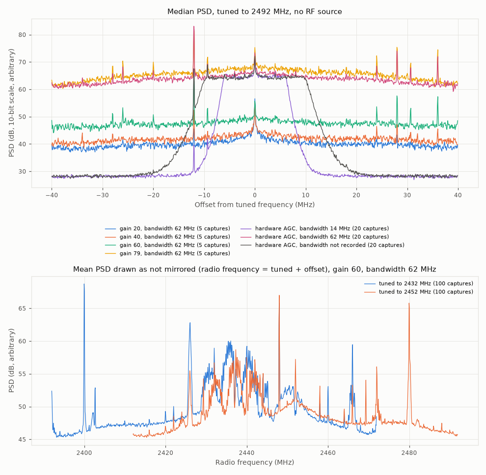

# ESP32-C3 bench checks without an RF source

This page records the first checks of a Seeed XIAO ESP32C3 running the ESP-SDR firmware, made
without any RF source connected (GitHub issue #41, part of the maintainer tasks in #11). It
covers the firmware's replies, the maximum number of samples per capture, the noise seen by
the receiver, narrow spurious lines, the sign of frequency, and what the acquisition reports
on noise-only captures.

Terms used on this page:

- *Sample:* one complex I/Q pair. *Capture:* one `CAP20` request, 16380 samples at 80 MSa/s
  (204.75 µs).
- *10-bit scale:* the integer values of each component as transferred by `CAP20`, from −512
  to 511. Means, standard deviations and powers below are on this scale.
- *I and Q:* the components as `snappnt.io.espsdr_iq` reads them (I is the high 10-bit field
  of each sample, Q the low field; see [ESP-SDR protocol](../design/espsdr-protocol.md),
  "Which component is I").
- *Power (dB):* 10·log10 of the mean of |x − mean(x)|² over one capture, on the 10-bit scale.
- *PSD:* power spectral density, the mean of 1024-point Hann-windowed periodograms of one
  capture after its mean is removed. dB values of PSDs are relative and uncalibrated.
- *Line:* a local maximum of the PSD more than 8 dB above the running median over 31 bins
  (about 2.4 MHz).

## Conditions

| Item | Value |
|---|---|
| Board | Seeed XIAO ESP32C3, U.FL connector left open (no antenna, no termination) |
| Surroundings | 2.4 GHz Wi-Fi access points nearby; nothing transmitted by the test |
| Firmware | ESP-SDR, written with the project's browser installer on 2026-10-02 |
| Host link | Native USB Serial/JTAG (`TRANSPORT USB 0`) |
| Software | `snappnt capture` (10-bit transfer, `CAP20`) and a short pyserial script for the replies |
| Analysis | `tools/plot_esp32_bench.py` |

The browser installer does not report which firmware commit it writes. The `CAPS` reply below
contains words (`SPEC SPECN SPECCAPS SPECSTAT DCT`) that the C3 receiver does not have at
commit `4935ac2`, the commit that [ESP-SDR protocol](../design/espsdr-protocol.md) cites, and
that it has at commit `550fade` (2026-10-01). The firmware is therefore newer than `4935ac2`;
the exact commit is unknown. Between those two commits, the code that answers `INFO`,
`CAP16`, `CAP20` and writes the `DATA` header did not change (upstream diff of
`main/targets/esp32c3/receiver.c`).

The recordings are kept locally and are not committed (`out/` is ignored by git).

## Firmware replies

Sent one at a time, each reply read completely before the next command:

```text
INFO        -> C3SDR 6 burst 16380
CAPS        -> CAPS SPEC SPECN SPECCAPS SPECSTAT DCT UARTBAUD RXLIMITS SERIALLEASE DUALSERIAL TUNEEXT LPFANA GAIN HWAGC IQ8
LIMITS?     -> LIMITS {"gain":[0,79,1],"bandwidth":[14,62,1,0],"rates":[80000000],"bits":[8,10]}
RANGE?      -> RANGE 100 6000 1
TRANSPORT?  -> TRANSPORT USB 0
GAIN?       -> GAIN HARDWARE -1 0 79 0
FREQ 2492   -> OK
```

- All replies match [ESP-SDR protocol](../design/espsdr-protocol.md) except `CAPS`, which has
  the additional words described above.
- Under hardware AGC, `GAIN?` reports gain index −1. The gain that the AGC chooses is
  therefore not known to the host, and it is not recorded in the SigMF metadata.

## Maximum samples per capture

| Request | Reply | Payload |
|---|---|---|
| `CAP20 256 0` | `DATA 256 <crc> 5` | 640 bytes, CRC-32 matches |
| `CAP20 16380 0` | `DATA 16380 <crc> 206` | 40 950 bytes, CRC-32 matches |
| `CAP20 16381 0` | `ERR command` | none |

The maximum on the ESP32-C3 is **16380 samples**, as the `INFO` reply states.
`src/snappnt/frontend/devices/esp32c3.yaml` assumed 16384 and is changed to 16380 with this
page. The results pages computed with 16384 samples (detection probability, false-alarm rate,
C/N0 bias) are not re-run: the difference is 4 samples, 0.02 % of the snapshot.

The CRC-32 in the `DATA` header matched `zlib.crc32` of the payload in every capture on this
page (more than 300), which confirms that the firmware's CRC is the standard reflected CRC-32.

## Noise statistics at 2492 MHz

Captures tuned to 2492 MHz, the whole-MHz frequency nearest the NavIC S-band centre
(2492.028 MHz).

| Gain | Analog bandwidth | Captures | I mean | Q mean | I std | Q std | I min..max | Q min..max | Power (dB) |
|---|---|---|---|---|---|---|---|---|---|
| index 20 | 62 MHz | 5 | 17 to 22 | 6 to 12 | 4.0 to 4.1 | 3.6 to 3.9 | −1..39 | −10..29 | 14.7 to 15.1 |
| index 40 | 62 MHz | 5 | 15 to 21 | 3 to 5 | 4.7 to 4.8 | 4.7 to 4.8 | −4..39 | −16..22 | 16.5 to 16.7 |
| index 60 | 62 MHz | 5 | −41 to −38 | −6 to −3 | 9.1 to 12.3 | 9.2 to 12.4 | −89..9 | −62..44 | 22.2 to 24.8 |
| index 79 | 62 MHz | 5 | −285 to −262 | −19 to 24 | 74.5 to 81.9 | 72.5 to 79.7 | −509..88 | −345..315 | 40.4 to 41.2 |
| hardware AGC | 14 MHz | 20 | −288 to −199 | −23 to 5 | 20.9 to 28.3 | 20.9 to 27.0 | −393..−111 | −130..122 | 29.4 to 31.7 |
| hardware AGC | 62 MHz | 20 | −276 to −173 | −22 to 50 | 43.5 to 140.2 | 42.8 to 136.8 | −511..264 | −492..490 | 35.7 to 45.8 |
| hardware AGC | not recorded (see below) | 20 | −296 to −199 | −44 to 3 | 26.5 to 34.4 | 26.2 to 32.7 | −423..−79 | −155..128 | 31.4 to 33.4 |

Ranges are over the captures of each row.

**DC offset.** Both components have a non-zero mean, and I has a much larger one than Q. At
gain index 79 and under hardware AGC the mean of I is about −200 to −300, roughly half of full
scale, while the mean of Q stays within about ±50. The offset drifts within one capture: in one
AGC capture the mean of I over successive eighths of the capture went from −282 to −257. A
mean this large leaves less range on the negative side of I; in one AGC capture with 62 MHz
bandwidth I reached −511, the end of the 10-bit range. At gain index 20 and 40 the offset is
small in absolute terms (about +20 on I) but still four to five times the standard deviation.

**Gain index.** The noise power rises by 2 dB from gain index 20 to 40, by 6 dB from 40 to
60, and by 17 dB from 60 to 79. The index is not linear in dB. At index 20 and 40 the standard
deviation is about 4, so the samples use only a few ADC steps.

**Hardware AGC.** With 62 MHz bandwidth the power varied by 10 dB between captures (35.7 to
45.8 dB), with 14 MHz by 2.3 dB. The wider band takes in more of the nearby Wi-Fi traffic, which
is present in some captures and not in others. This explanation is an assumption; the captures
were not checked one by one for Wi-Fi packets.

**Analog bandwidth.** The upper panel of the figure shows the median PSD for each setting.
With 14 MHz the pass band is about ±7 MHz wide and the floor outside it is about 36 dB below the
pass band. With 62 MHz the PSD is within a few dB across the whole ±40 MHz.

**Bandwidth not recorded.** In the last row, `snappnt capture` was run without
`--bandwidth-mhz` after the browser viewer had set 20 MHz. The firmware kept that setting, and
the PSD shows a pass band of about ±10 MHz, but the SigMF metadata contains no bandwidth.
This is tracked in #44.



## Narrow lines

Lines in the median PSD at 2492 MHz (height above the local floor; the line at 0 Hz is described
below the table):

| Setting | Lines (offset from 2492 MHz → radio frequency, height) |
|---|---|
| Gain 20, 62 MHz | none |
| Gain 40, 62 MHz | −12 MHz → 2480 MHz (11 dB) |
| Gain 60, 62 MHz | −12 MHz → 2480 MHz (16 dB); +28 MHz → 2520 MHz (10 dB); +36 MHz → 2528 MHz (10 dB) |
| Gain 79, 62 MHz | −12 MHz → 2480 MHz (16 dB); +28 MHz → 2520 MHz (11 dB); +36 MHz → 2528 MHz (12 dB) |
| AGC, 14 MHz | −12 MHz → 2480 MHz (10 dB) |
| AGC, 62 MHz | −12 MHz → 2480 MHz (19 dB); +28 MHz → 2520 MHz (11 dB); +36 MHz → 2528 MHz (10 dB) |

A line at 0 Hz remains after the mean is removed at some settings; it comes from the drift of
the DC offset within a capture.

With 14 MHz bandwidth the 2480 MHz line is still visible although it lies outside the pass
band. Weaker lines near −34, −28, −26, −20, +24 and +31 MHz are visible in the figure but stay below
the 8 dB criterion.

The lines stay at fixed radio frequencies when the tuned frequency changes (next section):
2400, 2440, 2448 and 2480 MHz were seen at 2432 or 2452 MHz. All lines seen so far are at
multiples of 4 MHz. That they are harmonics of a clock on the board is an assumption; the
board's clock frequencies were not checked.

For NavIC S-band the nearest lines are 2480 MHz (12 MHz below 2492.028 MHz) and 2520 MHz
(28 MHz above). Both are far outside the ±40 kHz frequency search of acquisition.

## Sign of frequency

[ESP-SDR protocol](../design/espsdr-protocol.md) left open whether a positive baseband
frequency from `espsdr_iq` corresponds to a radio frequency above the tuned frequency, or
whether the spectrum is mirrored. The check uses signals that are already present and
transmits nothing.

Captures: 100 at 2432 MHz and 100 at 2452 MHz (both Wi-Fi channel centres), gain index 60,
62 MHz bandwidth. If the spectrum is not mirrored, a signal at a fixed radio frequency appears
at a baseband offset 20 MHz lower in the 2452 MHz captures than in the 2432 MHz captures. If
it is mirrored, it appears 20 MHz higher.

1. **Lines.** Read as not mirrored, the lines at 2440 MHz (10 dB and 10 dB) and 2448 MHz
   (18 dB and 18 dB) fall on the same radio frequency at both tuned frequencies, with the
   same heights. Read as mirrored, two pairs also coincide (2424 MHz and 2464 MHz), but with
   heights of 10 and 18 dB and of 22 and 10 dB.
2. **Wi-Fi traffic.** The mean PSDs, median-filtered over 9 bins so that broad signals decide,
   match best when the 2452 MHz spectrum is shifted by −18.4 MHz (correlation 0.82). The
   correlation is 0.69 at −20 MHz (not mirrored) and −0.39 at +20 MHz (mirrored). The traffic
   was not the same during the two recordings, which limits this measure.

**Result: the spectrum is not mirrored.** A positive frequency from `espsdr_iq` is a radio
frequency above the tuned frequency, which is the convention the simulator and the acquisition
use. The lower panel of the figure draws both recordings against radio frequency on this
basis.

## Acquisition on noise-only captures

NavIC S-band SPS, PRN 10, centre +28 kHz (2492.028 MHz − 2492 MHz), search ±40 kHz, one
block, `pfa` = 0.001 (the default). Five captures of each 2492 MHz setting (35 captures), each once as
recorded and once with its mean subtracted:

| Input | Largest cell | Metric | Detections |
|---|---|---|---|
| As recorded | about 172 to 180 chips and −10696 or −8254 Hz in 29 of 35 captures; about 304 chips and −27790 Hz in 4 more | 7.4 to 8.3 | 0 of 35 |
| Mean subtracted | different in each capture | 10.9 to 16.3 | 0 of 35 |
| White Gaussian noise, 16380 samples, seeds 0 to 29 (reference) | different in each trial | 11.6 to 17.4 (median 13.6) | 0 of 30 |

The threshold was 21.7 throughout. There were no false detections.

As recorded, the largest cell is almost always in one of two places, at every gain setting
including index 20 where the offset is only about +20. With the mean subtracted, the largest
cell moves from capture to capture and the metric falls in the same range as for white
Gaussian noise. As far as this metric shows, the receiver noise after mean removal behaves like
white Gaussian noise for acquisition.

The lower metric as recorded means that the DC offset raises the noise-floor estimate that
the metric divides by. That a real signal would lose sensitivity by the same mechanism is an
assumption; it is measured in #43, with a simulated DC offset from #42.

## Not checked

- The firmware commit (see Conditions).
- The noise figure of the receiver and the absolute gain at each index: no calibrated source
  was connected.
- Whether the AGC power variation is caused by Wi-Fi traffic.
- Any tuned frequency other than 2432, 2452 and 2492 MHz.

## Reproduce

```bash
uv sync --extra hw
uv run snappnt capture <port> --freq-hz 2492e6 --bandwidth-mhz 62 --gain 60 --count 5 -o out/noise/g60
uv run snappnt capture <port> --freq-hz 2432e6 --bandwidth-mhz 62 --gain 60 --count 100 -o out/sign/lo2432
uv run snappnt capture <port> --freq-hz 2452e6 --bandwidth-mhz 62 --gain 60 --count 100 -o out/sign/lo2452
uv run --extra plot python tools/plot_esp32_bench.py out/noise out/sign -o docs/results/esp32c3-bench-no-rf.png
uv run --extra plot python tools/plot_esp32_bench.py out/noise --acquire-prn 10 --acquire-max 5
```

The other rows of the table use `--gain 20`, `40`, `79` with `--count 5`, and `--gain auto`
with `--bandwidth-mhz 14` or `62` and `--count 20`.
