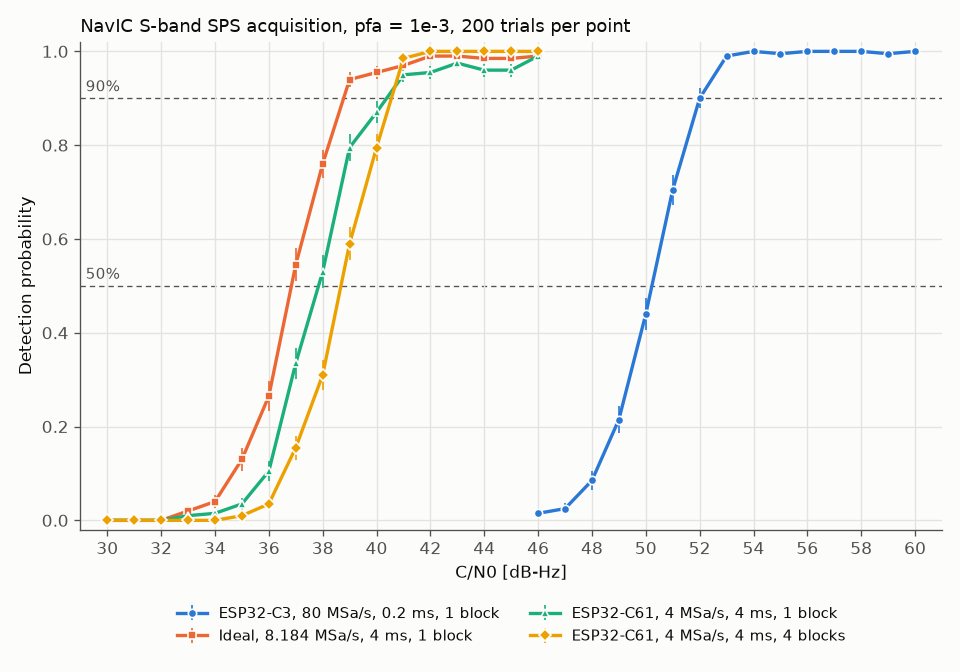

# Detection probability versus C/N0

This page records the probability that acquisition finds a NavIC S-band SPS signal at the
right place, as a function of its carrier-to-noise density ratio C/N0, for four receiver
conditions (GitHub issue #2). These curves are the simulated reference that the conducted
test of milestone M3 will be compared with.

## What is measured

For each C/N0 value, `snappnt sweep` generates a snapshot with one satellite (PRN 10) and runs
acquisition on it, 200 times. In each trial it draws new values of:

- the code phase (uniform over the 1023-chip code),
- the carrier phase (uniform over 0 to 2π),
- the noise seed, and with it the data symbols and the position of the first symbol edge.

The Doppler is not drawn: it stays at the scenario value, 0 Hz, and the carrier offset is set
only by the scenario's clock error.

A trial counts as a **detection** (`p_detect`) when the detection metric exceeds the threshold
*and* the peak is within 0.5 chip of the true code phase and within one frequency bin of the
true carrier offset. A trial whose metric exceeds the threshold at any other place counts as
a **wrong detection** (`p_wrong`), not as a detection. The threshold is set for a false-alarm
probability `pfa` = 1e-3 over the whole search grid; see
[False-alarm rate versus the configured `pfa`](false-alarm.md) for how well that holds.

## Conditions

| Scenario file | Sample rate | Snapshot | Quantization | Clock error | Blocks (B) | Frequency search | C/N0 grid |
|---|---|---|---|---|---|---|---|
| `navic_s_esp32c3.yaml` | 80 MSa/s | 16 384 samples (about 0.2 ms) | 10 bits, 12 dB AGC backoff | 12 ppm | 1 | ±40 kHz | 46–60 dB-Hz |
| `navic_s_ideal.yaml` | 8.184 MSa/s | 32 736 samples (4 ms) | none | 0 ppm | 1 | ±2 kHz | 30–46 dB-Hz |
| `navic_s_esp32c61_4msps.yaml` | 4 MSa/s | 16 384 samples (about 4.1 ms) | none | −8 ppm | 1 | ±40 kHz | 30–46 dB-Hz |
| `navic_s_esp32c61_4msps.yaml` | 4 MSa/s | 16 384 samples (about 4.1 ms) | none | −8 ppm | 4 | ±40 kHz | 30–46 dB-Hz |

- B is the number of blocks the snapshot is cut into; the blocks are correlated separately
  and added in power (non-coherent integration). With B = 4 on the ESP32-C61 condition each
  block is about 1 ms long.
- The ±40 kHz search covers the carrier shift caused by the clock error at 2492.028 MHz:
  about −29.9 kHz for 12 ppm and about +19.9 kHz for −8 ppm. `navic_s_ideal` has no clock
  error and no Doppler, so ±2 kHz is enough there; this is the range used in
  `tests/test_loopback.py`.
- The frequency step is the default of `acquire`, 1/(2T), where T is the length of one block.
- C/N0 grid in 1 dB steps; 200 trials per point; `--seed 0`.
- The ESP32-C61 scenario assumes an ideal decimating filter before the 4 MSa/s sampling. If the
  low sample rate is produced by clock division without band limiting, noise folds into the
  band and the curves move to higher C/N0. That effect is studied in issue #3 and is **not**
  included here.

## Results



Error bars are ±1 binomial standard deviation, sqrt(Pd (1 − Pd) / 200).

The 50 % and 90 % points are found by linear interpolation between the two adjacent grid
points where `p_detect` first reaches 0.5 or 0.9. With 200 trials the standard deviation of
`p_detect` near 0.5 is about 0.035, which at the observed slopes of 0.2 to 0.3 per dB
corresponds to roughly ±0.2 dB on the 50 % point.

| Condition | 50 % point | 90 % point |
|---|---|---|
| ESP32-C3, 80 MSa/s, 0.2 ms, B = 1 | 50.2 dB-Hz | 52.0 dB-Hz |
| Ideal, 8.184 MSa/s, 4 ms, B = 1 | 36.8 dB-Hz | 38.8 dB-Hz |
| ESP32-C61, 4 MSa/s, 4 ms, B = 1 | 37.8 dB-Hz | 40.4 dB-Hz |
| ESP32-C61, 4 MSa/s, 4 ms, B = 4 | 38.7 dB-Hz | 40.6 dB-Hz |

All four curves reach 0.9 inside their C/N0 grid.

Data files (columns `cn0_dbhz`, `trials`, `p_detect`, `p_wrong`, `mean_metric`):

- [pd_navic_s_esp32c3.csv](pd_navic_s_esp32c3.csv)
- [pd_navic_s_ideal.csv](pd_navic_s_ideal.csv)
- [pd_navic_s_esp32c61_4msps_b1.csv](pd_navic_s_esp32c61_4msps_b1.csv)
- [pd_navic_s_esp32c61_4msps_b4.csv](pd_navic_s_esp32c61_4msps_b4.csv)

## Comparison with the early estimates

The first version of the repository gave rough numbers from 20 trials per point
(`docs/project/milestones.md`). The difference below is the distance from the measured 50 %
point to the nearest end of the estimated range.

| Condition | Early estimate | This page | Difference |
|---|---|---|---|
| ESP32-C3, 50 % point | 50–51 dB-Hz | 50.2 dB-Hz | 0 dB (inside the range) |
| ESP32-C3, 100 % | about 54 dB-Hz | `p_detect` 0.99–1.00 from 53 dB-Hz | consistent |
| ESP32-C61, four 1 ms blocks (B = 4), 50 % point | 37–38 dB-Hz | 38.7 dB-Hz | +0.7 dB |

Both 50 % points agree with the early estimates to within 1 dB.

## Discussion

**Short snapshot at 80 MSa/s.** The ESP32-C3 condition needs about 13 dB more C/N0 than the
4 ms conditions for the same detection probability. Its snapshot is about 0.2 ms long, one
twentieth of 4 ms, which alone accounts for 10·log10(20) ≈ 13 dB of coherent integration gain.

**The threshold at 80 MSa/s is stricter than configured.** At 80 MSa/s the measured false-alarm
rate was about a quarter of the configured `pfa` ([False-alarm rate](false-alarm.md)). The
threshold is therefore higher than a threshold set for the true `pfa` would be, and the
ESP32-C3 curve sits slightly to the right of where such a threshold would put it. This page
does not correct for that.

**One coherent block versus four blocks on the ESP32-C61.** With B = 1 the 50 % point is
0.9 dB lower than with B = 4, as expected from coherent integration over the full 4 ms. At
90 % the two are almost equal (40.4 and 40.6 dB-Hz).

**Curves with one 4 ms coherent block do not settle at 1.00.** `navic_s_ideal` stays at
`p_detect` 0.95–0.99 from 39 dB-Hz upwards, and the ESP32-C61 condition with B = 1 stays at
0.95–0.99 from 41 dB-Hz upwards. In both, `p_wrong` is 0.01–0.04 at those C/N0 values, so the
metric crosses the threshold but the peak is reported at the wrong place. The ESP32-C61
condition with B = 4 reaches 1.00 from 42 dB-Hz. *Hypothesis, not verified:* NavIC SPS data
symbols are 20 ms long, so a 4 ms snapshot contains a symbol edge in about one trial in five,
and the sign changes at about half of those edges. A sign change inside one coherent block
splits the correlation peak in frequency, and the strongest part can then fall more than one
frequency bin from the true carrier offset. With B = 4 the sign change affects only one 1 ms
block. TODO: confirm by repeating the B = 1 runs with the data symbols switched off, or by
checking the frequency error of the wrong detections.

## How to regenerate

The four sweeps (about 8, 9, 57 and 15 minutes on one CPU core each; they can run in
parallel):

```bash
pip install -e ".[dev]"
snappnt sweep scenarios/navic_s_esp32c3.yaml --cn0 46:60:1 --trials 200 --freq-span 40000 -o docs/results/pd_navic_s_esp32c3.csv
snappnt sweep scenarios/navic_s_ideal.yaml --cn0 30:46:1 --trials 200 --freq-span 2000 -o docs/results/pd_navic_s_ideal.csv
snappnt sweep scenarios/navic_s_esp32c61_4msps.yaml --cn0 30:46:1 --trials 200 --freq-span 40000 --blocks 1 -o docs/results/pd_navic_s_esp32c61_4msps_b1.csv
snappnt sweep scenarios/navic_s_esp32c61_4msps.yaml --cn0 30:46:1 --trials 200 --freq-span 40000 --blocks 4 -o docs/results/pd_navic_s_esp32c61_4msps_b4.csv
```

The plot and the table of 50 % and 90 % points:

```bash
pip install -e ".[plot]"
python tools/plot_pd_curves.py
```
