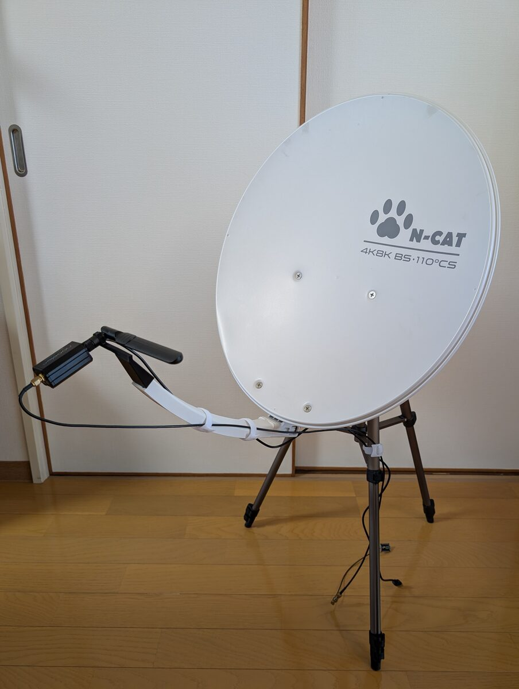
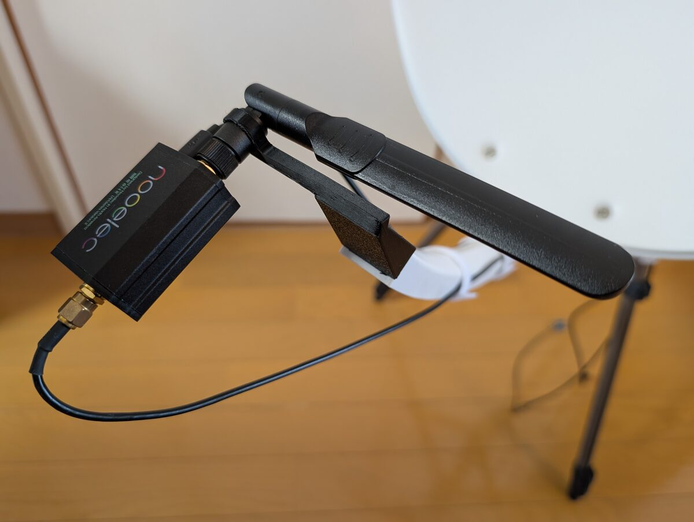

# NavIC S-band from the sky on an ESP32-C5 (preliminary)

This page reports a **preliminary experiment** made with equipment at hand: a 45 cm offset dish,
a 2.4 GHz rod antenna as the feed and, in some sets, a reflector held by hand. In it, an ESP32
receiver acquired a NavIC S-band SPS signal from the sky for the first time in this project: a
Seeed XIAO ESP32-C5 running ESP-SDR acquired PRN 10 in single 4.1 ms snapshots on 2026-10-06. A
dedicated feed (a helical antenna) is being prepared for a measurement that can be repeated. The
satellite is identified by its PRN; that NVS-01 transmits PRN 10 comes from secondary sources
([Wikipedia](https://en.wikipedia.org/wiki/NVS-01)) and is not verified here.

No receiver position, satellite azimuth or elevation, code-phase value or instrument serial
number is given on this page ([Public-safety rules](../development/public-safety.md)).

## Setup

| Part | Item |
|---|---|
| Reflector | 45 cm offset dish made for 12 GHz satellite TV, LNB removed, in its normal orientation (feed arm straight below the dish), on a camera tripod |
| Feed | 2.4 GHz rod antenna (linear polarisation), laid across the focal point with its axis parallel to the dish face, on a home-made mount at the end of the feed arm |
| Connector adapter | RP-SMA female to SMA male (the rod antenna has an RP-SMA plug; see "Earlier attempt with the same rod antenna") |
| Low-noise amplifier | Nooelec LaNA, powered from a USB battery, directly behind the feed |
| Receiver | Seeed XIAO ESP32-C5. The output of the amplifier goes to the board's u.FL connector, which is the receiver input on this board (checked with a 50 Ω termination, issue #78). ESP-SDR built on 2026-10-02 |
| Reference receiver | B210 clone with GQRX, 8 MSa/s, analog bandwidth 8 MHz, PGA 40 dB, used to point the dish |
| Site | A balcony with an open view of part of the southern sky |

ESP32-C5 settings: `FREQ 2492` (NavIC S at +28 kHz), 4 MSa/s, 16 380 samples per capture
(4.1 ms), `BANDWIDTH 11` (the narrowest setting, PHY mode 0; `ALPF 60 14 15`), `GAIN MANUAL 70`
(index 77 saturated the 10-bit samples; at 70 at most 0.05 % of the samples reached full scale).

The dish and the feed were not moved between the last reference measurement and the ESP32-C5
captures; only the receiver cable was moved from the B210 clone to the ESP32-C5.

The two photographs below were taken indoors after the measurement. The tilt of the dish in
them is not the pointing used in the measurement, and the amplifier is not connected to its
battery or to a receiver.





## Pointing the dish with the reference receiver

The B210 clone recorded through the same feed and amplifier. PRN 10 and PRN 7 were acquired in
1 s of non-coherent integration (250 blocks of 4 ms) with code-Doppler compensation, after
removing narrow interference lines and blanking interference bursts (0.25 ms chunks above
twice the median power). The C/N0 values are the estimate of `acquire()` (`cn0_dbhz_est`),
which ignores implementation losses ([C/N0 estimate bias](cn0-bias.md)).

| Configuration | PRN 10 | PRN 7 |
|---|---|---|
| Small vertical whip, no dish (2026-10-04) | about 33 dB-Hz | about 28 dB-Hz |
| Dish, first position | 35.4 dB-Hz | 33.4 dB-Hz |
| Dish, best position found | 42.6 to 43.2 dB-Hz | 38 to 41 dB-Hz |

- The best position was found by tilting the dish in steps and by a slow azimuth sweep of
  about 20° during one 22 s recording, evaluated every 0.5 s. PRN 10 changed by about 10 dB
  within a few degrees.
- Moving the feed sideways by about 1 to 2 cm steered the beam (PRN 10 dropped by 4 to 10 dB);
  moving it 1 cm away from the dish changed nothing measurable.
- Pointing the dish at the open sky also reduced interference bursts from about 20 % of the
  time to under 1 %.

## ESP32-C5 captures and processing

Each set is 50 captures taken within 2.7 s. The only processing before acquisition was
subtracting the mean of each capture (DC); no narrow-line removal and no burst blanking were
applied to the ESP32-C5 captures.

Each capture was searched on its own, as one coherent block of 4.1 ms (no non-coherent
combining):

1. **Wide search:** ±100 kHz around +28 kHz (the ESP32-C5's crystal error is not known). The
   threshold metric is 22.6 for a false-alarm probability of 1e-3 over the grid. The frequency
   where most peaks of the set lie within ±300 Hz is taken as the set's signal frequency.
2. **Narrow search:** ±1 kHz around that frequency (about 17 frequency bins × 4000 code-phase
   cells). The threshold is 18.0 (18.035 before rounding) for the same false-alarm probability
   over this smaller grid.

The L5 code of PRN 10, which is not transmitted in the S band, was searched in the same way
with the same centre frequency as a noise-only reference. A detection is a capture whose largest
metric exceeds the threshold; the cell of the peak is not checked against a truth. The mean
metric is the mean over all 50 captures of the narrow search, detected or not.

## Results

| Time (UTC) | Condition | Wide-search peaks within ±300 Hz of the set's frequency | Wide-search detections | Narrow-search detections | Mean metric (narrow, all 50) | Noise reference detections (narrow) |
|---|---|---|---|---|---|---|
| 14:59:44 | No reflector | 14 | 6 | 11 | 15.6 | 0 |
| 15:05:20 | Aluminium disc placed behind the feed | 8 | 5 | 15 | 17.0 | 0 |
| 15:08:39 | Disc held by hand behind the feed | 37 | 24 | 32 | 24.5 | 0 |
| 15:10:45 | Disc held by hand, second time | 41 | 41 | 41 | 56.8 | 0 |
| 15:11:31 | Hand only, in the same position and shape as when holding the disc | 32 | 25 | 30 | 26.6 | 0 |
| 15:12:27 | No reflector | 22 | 11 | 23 | 21.3 | 0 |

The reflector was an aluminium disc of 120 mm diameter, 3 to 4 cm behind the rod (estimated
by the maintainer), on the side away from the dish.

### Captures hit by interference

A capture counts as hit by interference when its power (each capture's mean removed) is more
than 3 dB above the median of its set.

| Set | Captures hit by interference | Of those, missed (narrow search) | All missed (narrow search) |
|---|---|---|---|
| 14:59 no reflector | 11 | 11 | 39 |
| 15:05 disc placed | 4 | 4 | 35 |
| 15:08 disc held | 8 | 8 | 18 |
| 15:10 disc held | 17 | 9 | 9 |
| 15:11 hand only | 15 | 15 | 20 |
| 15:12 no reflector | 11 | 11 | 27 |

In the 15:10 set the per-capture metrics form two groups: the 41 detected captures have
metrics of 22.9 to 151.9, mean power 27.2 dB (10-bit scale, DC removed) and largest I or Q
samples of 72 to 339; the 9 missed captures have metrics of 10.6 to 13.9 (the noise-only level),
mean power 36.3 dB, and largest samples of 132 to 512, three of them at full scale.

Facts:

- In every set, the PRN 10 peaks clustered at one frequency, and every wide-search detection
  lay in that cluster. Under noise alone a peak falls within ±300 Hz of a given frequency in
  about 0.3 % of captures (600 Hz out of a 200 kHz search).
- The noise-only reference was never detected.
- In every set except 15:10, every capture hit by interference was missed. In the 15:10 set, 8
  of the 17 captures hit by interference were still detected, and all 9 missed captures were hit
  by interference.
- The set frequency moved between sets: 7.26, 5.27, 7.26, 7.65, 8.19 and 8.68 kHz. Within the
  15:05 set it moved by about 160 Hz in 2.7 s.
- Between the two no-reflector sets, 13 minutes apart, the mean metric changed from 15.6 to
  21.3.

## Comparison with simulation

`snappnt sweep` was run with the scenario `scenarios/navic_s_esp32c5_4msps_b11.yaml`
([on GitHub](https://github.com/h-shiono/snappnt/blob/main/scenarios/navic_s_esp32c5_4msps_b11.yaml)):
4 MSa/s obtained by keeping every 20th sample of 80 MSa/s with an 11 MHz analog bandwidth (the
noise folding measured on the ESP32-C5 and recorded in
[issue #78](https://github.com/h-shiono/snappnt/issues/78#issuecomment-6019905251)), 16 380
samples, 10-bit quantisation, navigation data symbols included, one block, ±1 kHz search,
false-alarm probability 1e-3, 100 trials per point
([pd_esp32c5_4msps_b11_narrow.csv](pd_esp32c5_4msps_b11_narrow.csv)). There is no ESP32-C5 device
file yet (#78), so the scenario names the ESP32-C61 device only for its 10-bit quantisation and
capture limit and sets the other receiver fields directly. C/N0 in the simulation is the C/N0 at
the receiver input, before folding and quantisation.

The ESP32-C5 measurement on #78 gives a −3 dB full width of 10.4 MHz for `BANDWIDTH 11`; the
scenario uses 11 MHz. In the folding model this changes the loss by about 0.25 dB
(10·log10(11/4) − 10·log10(10.4/4)).

Selected values (the CSV has every point from 34 to 50 dB-Hz):

| C/N0 | 38 | 40 | 41 | 42 | 43 | 44 | 46 | 47 | 48 dB-Hz |
|---|---|---|---|---|---|---|---|---|---|
| `p_detect` | 0.03 | 0.19 | 0.30 | 0.49 | 0.70 | 0.93 | 0.93 | 0.96 | 0.96 |
| `p_detect + p_wrong` | 0.03 | 0.19 | 0.31 | 0.49 | 0.70 | 0.94 | 1.00 | 1.00 | 1.00 |
| Mean metric | 12.3 | 14.4 | 16.3 | 19.8 | 22.7 | 29.6 | 45.5 | 55.5 | 72.7 |

`p_detect` counts captures above the threshold at the true cell (code phase within 0.5 chip,
frequency within one step) and `p_wrong` those above the threshold at another cell. Under noise
alone the mean metric is about 11.5, the expected maximum over the grid. `p_detect` stays at 0.93
to 0.97 above 44 dB-Hz because 3 to 7 % of the captures are detected at a wrong cell. The likely
cause, not checked in the simulation, is a sign change of the navigation data inside the 4.1 ms
block, which can move the correlation peak by more than one frequency step. It does not bring the metric down to the noise level; `p_detect + p_wrong`
reaches 1.00 from 46 dB-Hz. Since the measured detections are not checked against a cell, they
correspond to `p_detect + p_wrong`.

### C/N0 of each set

The main estimate uses only the captures not hit by interference. The signal is more than 20 dB
below the noise in each capture, so selecting captures by their total power does not select them
by signal strength. Their detection rate was inverted on the `p_detect + p_wrong` curve. For
comparison, the estimates from all 50 captures are kept: from the detection rate (inverted on
`p_detect`; on `p_detect + p_wrong` they change by at most 0.08 dB) and from the mean metric.
The detection-rate column reads 0.1 to 1.2 dB below the main estimate, because captures hit by
interference count as misses. The mean-metric column agrees with the main estimate within 0.2 dB
in the five sets where both are given (14:59 −0.2, 15:05 +0.1, 15:08 0.0, 15:11 −0.1,
15:12 0.0 dB); why it is not lowered in the same way was not examined.

| Set | Captures without interference | Detected among them | C/N0, captures without interference (main) | C/N0, all 50, from detection rate | C/N0, all 50, from mean metric |
|---|---|---|---|---|---|
| 14:59 no reflector | 39 | 11 | 40.8 dB-Hz | 40.3 dB-Hz | 40.6 dB-Hz |
| 15:05 disc placed | 46 | 15 | 41.1 dB-Hz | 41.0 dB-Hz | 41.2 dB-Hz |
| 15:08 disc held | 42 | 32 | 43.3 dB-Hz | 42.7 dB-Hz | 43.3 dB-Hz |
| 15:10 disc held | 33 | 33 | about 43.9 dB-Hz or more (one-sided 95 %; 33 of 33 detected) | 43.5 dB-Hz | 47.1 dB-Hz |
| 15:11 hand only | 35 | 30 | 43.7 dB-Hz | 42.5 dB-Hz | 43.6 dB-Hz |
| 15:12 no reflector | 39 | 23 | 42.5 dB-Hz | 41.8 dB-Hz | 42.5 dB-Hz |

Uncertainty: a detection rate from 39 to 46 captures has a binomial spread (for example
11/39 = 0.28 ± 0.07), which is about ±0.3 to ±0.6 dB on the curve; with all 50 captures, for
example 11/50 = 0.22 ± 0.06, about ±0.5 dB near 40 to 41 dB-Hz. These ranges cover the measured
side only. Each simulated point is also the result of 100 trials (for example 0.31 ± 0.05 at
41 dB-Hz and 0.70 ± 0.05 at 43 dB-Hz), which adds about ±0.2 to ±0.4 dB between 40 and 44 dB-Hz.
The two contributions are not combined here.

For the 15:10 set, 33 of 33 detected captures give only a lower bound: the one-sided 95 % lower
bound on the rate is 0.05^(1/33) ≈ 0.913, which lies at about 43.9 dB-Hz on the
`p_detect + p_wrong` curve (linear interpolation between 43 and 44 dB-Hz). At 44 dB-Hz the
probability of 33 of 33 is about 0.13. The detection rate cannot separate higher values, because
the curve is close to 1 above 44 dB-Hz. The mean metric of the 33 captures without interference
(74.3), inverted on the simulated mean-metric curve, gives about 48.1 dB-Hz (computed by the
maintainer from the captures).

## Inferences

- The ESP32-C5 acquires PRN 10 in single 4.1 ms snapshots behind this dish, in 22 to 82 % of
  the captures of the narrow search depending on the set.
- Without a reflector, the C/N0 at the ESP32-C5's input was about 40.8 to 42.5 dB-Hz from the
  captures without interference, close to the B210 clone's 43 dB-Hz with the same antenna. With
  the amplifier in front, both receivers probably see a noise floor set mainly by the amplifier.
  The two numbers are not defined in the same way: the B210 value is `acquire()`'s estimate,
  which does not correct frequency and code-phase straddle losses and therefore reads low
  ([C/N0 estimate bias](cn0-bias.md)), so it is close to a lower bound, and the true gap may be
  somewhat larger than it looks. The ESP32-C5 values come from the simulation, which includes
  folding and quantisation.
- The moving set frequency is the ESP32-C5's crystal (1 ppm at 2492 MHz is 2.5 kHz), probably
  changing with temperature. A narrow search must be centred anew for each set.
- The missed captures in the 15:10 set are explained by strong interference in those captures,
  not by sign changes of the navigation data: in the simulation, data sign changes cause
  detections at a wrong cell, not misses.
- Between 8 and 34 % of the ESP32-C5 captures were hit by interference, while the B210 recording
  through the same dish had interference bursts in under 1 % of the time. A 4.1 ms capture
  counts as hit if a short burst falls anywhere inside it, so the per-capture rate is much higher
  than the fraction of time; the two numbers are not directly comparable.
- Reflector: without interference, the hand-only set (15:11, about 43.7 dB-Hz, ±1 standard
  deviation 43.4 to 43.9 dB-Hz) is above the disc-held set at 15:08 (about 43.3 dB-Hz). The 15:10
  set is the only one whose evidence points higher: its detection rate gives about 43.9 dB-Hz or
  more, the mean metric of all 50 captures 47.1 dB-Hz and that of the 33 captures without
  interference about 48.1 dB-Hz. By the detection rate alone it is barely separated from the
  hand-only set. These measurements do not establish the reflector's effect. The disc was held
  by hand and its position was not repeatable.

## Earlier attempt with the same rod antenna

Earlier recordings with this rod antenna, with and without the amplifier, showed no NavIC
signal. The rod antenna has an RP-SMA plug, whose centre is a socket, like the SMA jacks of the
receivers; the centre conductor was therefore never connected. With an RP-SMA-to-SMA adapter
the same antenna works. Antennas sold for 2.4 GHz Wi-Fi often use RP-SMA; check the centre pin
before connecting one to an SMA receiver.

## Next steps

- **Helical antenna.** Measure with the helical antenna being prepared. A helix used as a dish
  feed must be left-hand circularly polarised, because one reflection turns the right-hand signal
  into left-hand; a helix pointed directly at the satellite must be right-hand.
- **Fixed reflector.** A reflector a quarter wavelength (3.0 cm at 2492 MHz) behind a linear
  element turns the element's rear response towards the dish (a dipole with a reflector), which
  can give up to about 3 dB. This is the reason to try a reflector fixed at that distance; these
  measurements do not establish its effect.
- The rod antenna loses about 3 dB on the circularly polarised signal; a left-hand circularly
  polarised feed would recover these 3 dB.

## Not verified

- The satellite behind PRN 10 (and PRN 7) is taken from secondary sources.
- The ESP32-C5's noise figure, and the gain of the dish and feed, were not measured.
- Per-capture power was examined with one criterion (3 dB above the set's median); weaker
  interference below that level was not looked for.

## How to regenerate

The simulation (about 1 minute). `snappnt sweep` draws the seed of each C/N0 point in sequence,
so the second command must start at 46 dB-Hz as below; its 46 dB-Hz row is left out when the two
files are joined:

```bash
uv sync
S="--trials 100 --freq-span 1000 --blocks 1 --pfa 0.001"
uv run snappnt sweep scenarios/navic_s_esp32c5_4msps_b11.yaml --cn0 34:46:1 $S --seed 0 -o pd_a.csv
uv run snappnt sweep scenarios/navic_s_esp32c5_4msps_b11.yaml --cn0 46:50:1 $S --seed 1 -o pd_b.csv
{ cat pd_a.csv; tail -n +3 pd_b.csv; } > docs/results/pd_esp32c5_4msps_b11_narrow.csv
```

The captures and the analysis scripts are on the maintainer's machine. Reproducing them with
`snappnt` commands needs ESP32-C5 support in `snappnt capture` (issue #78), and for the reference
receiver the narrow-line removal and burst blanking discussed in issue #80.
